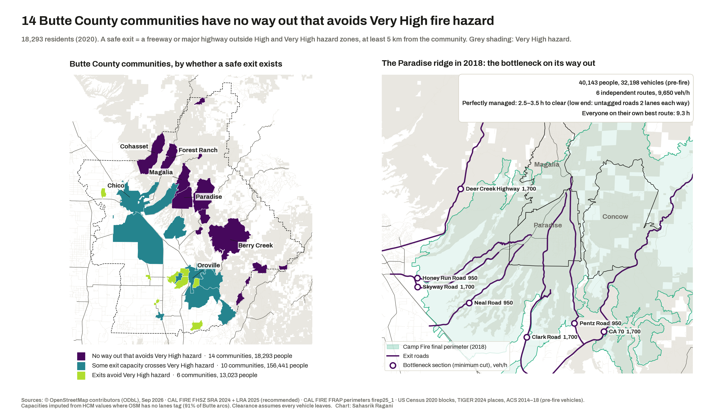
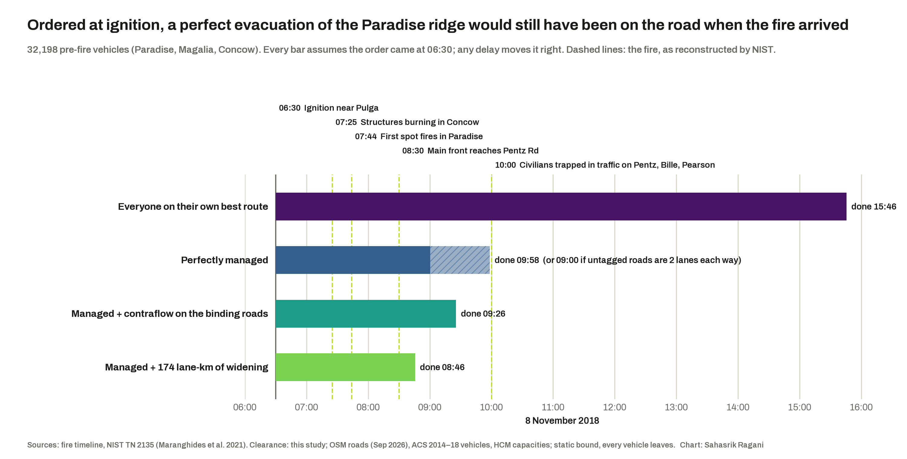

# California: who has one way out?

**Question.** Which California communities have too little road capacity out,
relative to the people who live there, and how much of that capacity runs
through high fire-hazard land?

**Headline finding (Butte County).** 14 of 30 communities, 18,293 residents,
have no way out that avoids Very High fire-hazard land. In 2018 the Paradise
ridge's 32,000 vehicles had six routes out: **2.5–3.5 hours** to clear even if
perfectly managed (the range is the lane-count uncertainty: 91% of Butte's
road segments have no lanes tag in OSM), and about 9 hours if every driver took
their own best route. NIST's reconstruction has the first spot fires reaching
Paradise about 75–80 minutes after ignition. The LA foothills (Palisades, Altadena) are next.



**What would help (policy layer).** Fewer than three in ten residents across
both study areas can get out within an hour without crossing Very High hazard.
Coordinating traffic (phased orders, traffic control) saved 6–13 hours per fire
group; 157–174 lane-km of widening saved barely one. Construction is the
answer only where one road binds (the Palisades Highlands; Berry Creek and
Cohasset). Opening fire roads would meet SB 99's two-route minimum for Berry
Creek and Cohasset, but gives no community a hazard-free exit. Full argument:
[`docs/POLICY.md`](docs/POLICY.md).



## Why capacity, not only the number of exits
Paradise had several routes out in November 2018 (Skyway, Clark, Pentz, Neal)
and still gridlocked. Counting routes would call it safe. This project measures
both **redundancy** (edge-disjoint paths out) and **capacity** (max-flow in
vehicles/hour against the resident population). It also runs a Crucitti–Latora–
Marchiori-style congestion model to estimate how much of that capacity is lost
when every driver takes their own best route.

California already asks cities and counties to run this test: SB 99 (2019) and
AB 747 (2019). This is an independent, reproducible version of it, compared
against Butte County's General Plan 2040 figures.

## Method in brief
- **Part A. Topology baseline.** SNAP roadNet-CA and DIMACS CAL, with nodes
  removed at random, by degree and by sampled betweenness. Measures: largest
  connected piece, and Latora–Marchiori global efficiency.
- **Part B. Spatial.** OSM drive network (osmnx) for Butte County and the LA
  County foothills. CAL FIRE Fire Hazard Severity Zones (SRA 2024 + LRA 2025)
  are overlaid on every road segment; communities are TIGER places (Butte) or
  LA County Countywide Statistical Areas (LA), with 2020 block population. For
  each community: disjoint paths, max-flow capacity, travel time and efficiency
  to a safe high-capacity destination, before and after Very High hazard roads
  are removed.
- The engine, `hazardnet/`, has no California-specific code. The Ahmedabad
  flood study will reuse it with a raster hazard.

Full design: [`docs/DESIGN.md`](docs/DESIGN.md).

## Reproduce
```bash
make env      # Python 3.12 venv via uv
make all      # fetch data, test, Part A, Part B, figures
```
Without `make` (Windows), run the lines under each Makefile target in order.
The Census API key goes in `.env` as `CENSUS_API_KEY=...` (not committed).

## Data and licences
See [`data/README.md`](data/README.md) for every source and URL, and
[`DATA_LICENSES.md`](DATA_LICENSES.md) for their terms. Code: MIT.

## Coverage gaps and biases (part of the finding)
- SNAP states no data vintage. DIMACS is older TIGER-derived data and includes
  Nevada (clipped out).
- OSM `lanes` tags are patchy, so capacity is often imputed by road class. The
  share imputed is reported per study area.
- Private roads and fire roads are excluded (the osmnx `drive` filter).
- Population is 2020 residents by block, not the people present at the time
  of a fire.
- The 2025 LRA hazard map is "recommended", not adopted everywhere. Current
  maps are used for the forward-looking ranking; the 2018 and 2025 fires are
  checked against their observed perimeters.

*Sahasrik Ragani · 2026*
